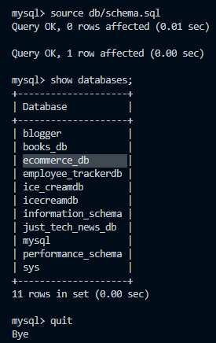
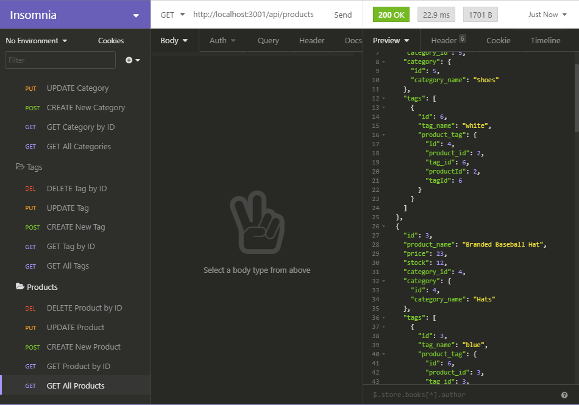

# BuyUp

  ## Description

  A backend e-commerce site utilizing Express.js API and Sequelize Object-Relational Mapping (ORM) to interact with a MySQL database.

  ## Table of Contents

  * [Installation](#installation)
  * [Usage](#usage)
  * [License](#license)
  * [Contribution](#contribution)
  * [Questions](#questions) 

  

  [BuyUp Demonstration Video](https://drive.google.com/file/d/1GcRfSpbkDkOAEBJ__6llkHigS8XB_pLQ/view)

  Video details the full process of creating the database, seeding the database with data from a directory called "seeds", and how to navigate through the different GET/POST/PUT/DELETE routes for "categories", "products", tags" with Insomnia as the API application used to test the routes functionability. 
  
  ## Installation
  Initiate a clone or pull of a project's repo onto your local machine, then change directories through terminal to the BuyUp directory. 
  
  You will need to initiate package dependencies with the following command:

  > npm install 

  The following should be installed automatically for you: Dotenv, Express.js, MySQL2, Sequelize, & nodemon.

  ## Usage
  To set-up Dotenv, please refer to instructions [here](https://www.npmjs.com/package/dotenv).

  Be sure to have a MySQL user set-up. Utilize the following commands afterwards:

  > mysql -u root -p

  This will prompt for a MySQL password associated to you.

  You should see "mysql >" waiting for input.

  > source db/schema.sql

  This will create the database.

  > show databases;

  This will show a list of your databases, you are specifically looking for "ecommerce_db".

  

  > quit

  This will exit MySQL.

  Type the following: 

  > npm run seed

  This command generates the database with the sample seed data from the "seeds" folder.

  You may start the server in two ways:

  > npm run watch

  or 

  > npm start

  An external application such as Insomnia or Postman is necessary to make API requests.

  

  To close the server, navigate out of Insomnia back to the terminal window and execute the following command:

  > CTRL+C
  
  > Y

  This will end the server connection.

  ## License
  This project is covered by the MIT license. 

  
  
  ## Contribution
  Contributor Covenant 2.0 available https://www.contributor-covenant.org/

  ## Questions
  Visit my GitHub: [Devmadia](https://github.com/Devmadia)

  If you have any additional questions not answered here or wish to contact me regarding developments, please email me at 
  [thedevmadia@gmail.com](mailto:thedevmadia@gmail.com)
  